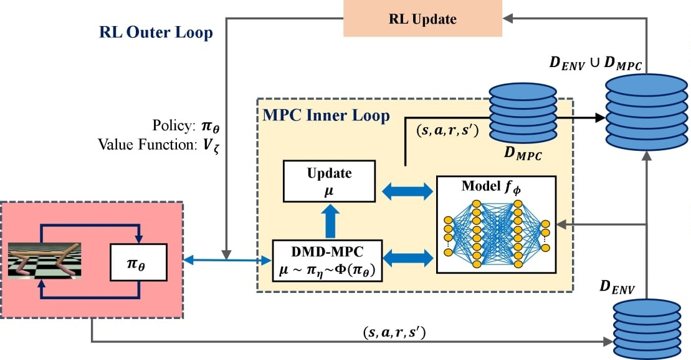
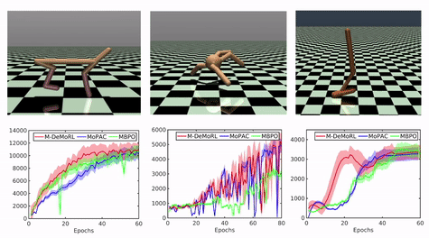
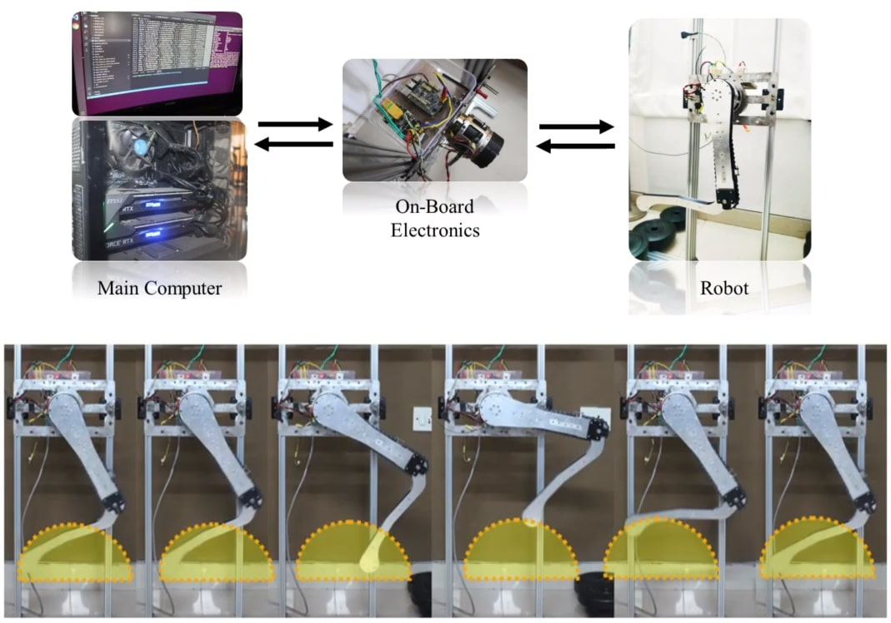

# Dynamic Mirror Descent based Model Predictive Control for Accelerating Robot Learning

**Authors**: [Utkarsh A. Mishra](https://utkarshmishra04.github.io), [Soumya R. Samineni](https://soumyarani.github.io/), Prakhar Goel, Chandravaran Kunjeti, Himanshu Lodha, Aman Singh, Aditya Sagi, [Shalabh Bhatnagar](https://www.csa.iisc.ac.in/~shalabh/) and [Shishir Kolathaya](https://shishirny.github.io/)

**Paper**: [arxiv.org/abs/1812.07829](arxiv.org/abs/1812.07829) 
**Video**: [https://youtu.be/Bj9dN1KNPAs](https://youtu.be/Bj9dN1KNPAs) 
  

**Abstract**: Recent works in Reinforcement Learning (RL) combine model-free (Mf)-RL algorithms with model-based (Mb)-RL approaches to get the best from both: asymptotic performance of Mf-RL and high sample-efficiency of Mb-RL. Inspired by these works, we propose a hierarchical framework that integrates online learning for the Mb-trajectory optimization with off-policy methods for the Mf-RL. In particular, two loops are proposed, where the Dynamic Mirror Descent based Model Predictive Control (DMD-MPC) is used as the inner loop Mb-RL to obtain an optimal sequence of actions. These actions are in turn used to significantly accelerate the outer loop Mf-RL. We show that our formulation is generic for a broad class of MPC-based policies and objectives, and includes some of the well-known Mb-Mf approaches. We finally introduce a new algorithm: Mirror-Descent Model Predictive RL (M-DeMoRL), which uses Cross-Entropy Method (CEM) with elite fractions for the inner loop. Our experiments show faster convergence of the proposed hierarchical approach on benchmark MuJoCo tasks. We also demonstrate hardware training for trajectory tracking in a 2R leg and hardware transfer for robust walking in a quadruped. We show that the inner-loop Mb-RL significantly decreases the number of training iterations required in the real system, thereby validating the proposed approach.

<!-- [methodology]: './assets/methodology.jpg'
[legresults]: './assets/legresults.jpg'
[hardresults]: './assets/hardresults.gif'
[simresults]: './assets/simresults.gif'
[stochresults]: './assets/stochresults.gif' -->

<p align="center">
  
</p>

<!-- ![alt text][methodology] -->

### Simulation Results

<p align="center">
  
</p>

### Hardware Results

<p align="center">
  
</p>

<p align="center">
   
</p>

<!-- <p align="center">
  
</p> -->

## Usage:

Use `Python 3.6` and install `requirements.txt`:
```
pip install -r requirements.txt
```
### For OpenAI environments:

Run:
```
python train_demo_env.py --exp_name {gym env id}
```
### For Other environments:

The environments directory contains the environments from:

- Dextrous Gym: 

- PDDM:

- Stoch:

Import the environment of your choice. Example of Stoch requires `PyBullet` and runs with:
```
python train_demo_stoch.py
```

## Citation:

## Acknowledgement:

We thank the authors of:

- LOOP and Stable Baselines for the structured open source code.
- Dextrous Gym, PDDM and Stoch Lab for their open source robot environments